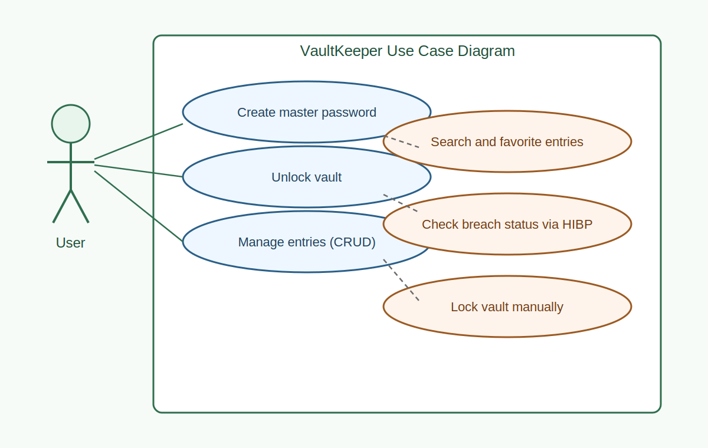

# Functional Requirements

## Functional requirements
- Create and confirm master password.
- Unlock vault.
- Create, read, update, delete entries.
- Search entries and mark favorites.
- Copy username/password values.
- Check breach status through HIBP.
- Lock vault from settings.

## Use case diagram

## Text scenarios

### Create vault
1. User launches app for first time.
2. User sets and confirms master password.
3. App stores verification metadata and opens vault.

### Add entry
1. User opens vault list and taps add button.
2. User fills form fields.
3. App encrypts password and saves entry in Room.

### Check breach status
1. User opens details/editor screen.
2. User runs breach check.
3. App sends only SHA-1 prefix to HIBP and compares suffix locally.
4. App returns result to user.
